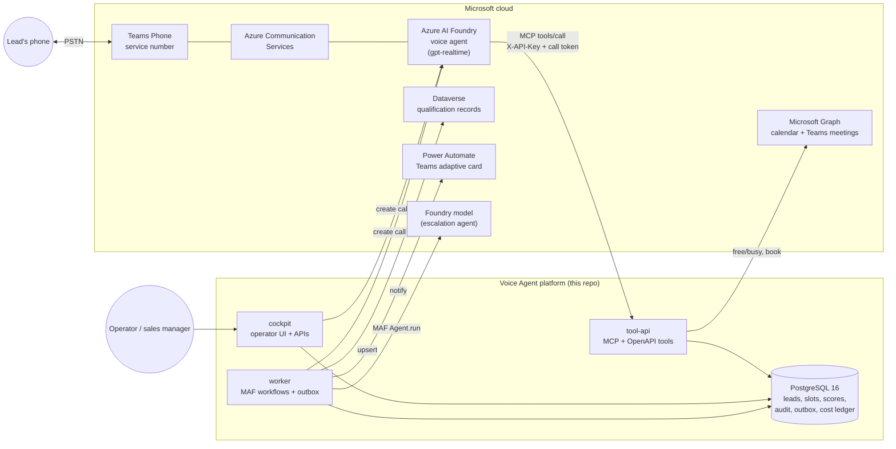
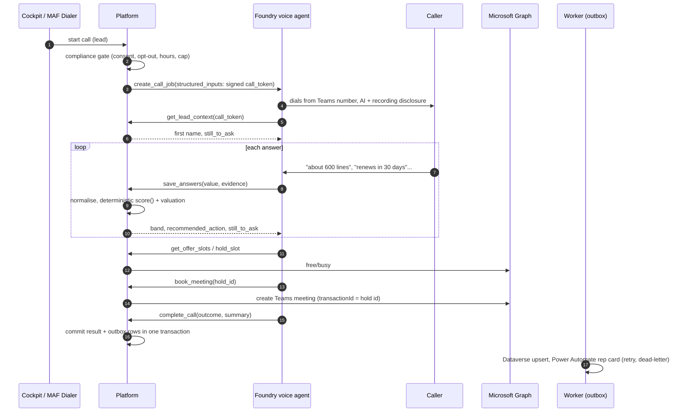
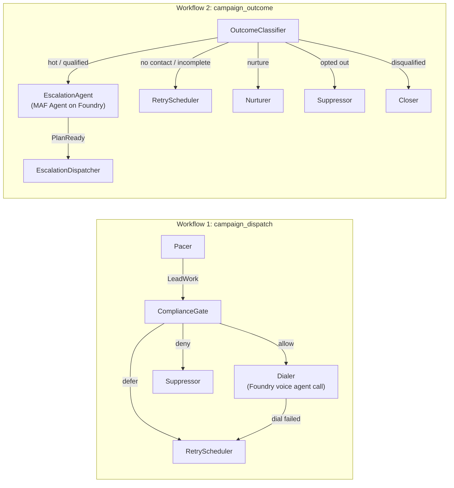

# Voice Agent: AI Sales Qualification on the Microsoft Stack

**An AI employee that calls leads from a Teams Phone number, qualifies them in a natural voice
conversation, books the right specialist, updates the CRM and briefs the sales rep in Teams,
orchestrated at campaign scale with Microsoft Agent Framework.**


| | |
|---|---|
| **Channel** | Teams Phone (Calling Plan, Operator Connect, Direct Routing) via Teams Phone extensibility and Azure Communication Services |
| **Conversation** | Azure AI Foundry voice agent on `gpt-realtime` (speech-to-speech) |
| **Actions** | 9 tools served over **MCP** and **OpenAPI** from one implementation |
| **Systems of record** | Microsoft Graph (calendars, Teams meetings), Dataverse (CRM), Power Automate (Teams adaptive cards) |
| **Orchestration** | Microsoft Agent Framework workflows, plus a MAF escalation agent on Foundry |
| **Controls** | Compliance gate, deterministic scoring, input/output guardrails, token budgets, OpenTelemetry |

---

## Contents

1. [Business problem](#business-problem)
2. [Solution overview](#solution-overview)
3. [Architecture](#architecture)
4. [How a call works](#how-a-call-works)
5. [Campaign orchestration with MAF](#campaign-orchestration-with-microsoft-agent-framework)
6. [Responsible AI and LLM controls](#responsible-ai-and-llm-controls)
7. [Security](#security)
8. [Reliability](#reliability)
9. [Observability](#observability)
10. [Repository layout](#repository-layout)
11. [Getting started](#getting-started)
12. [Configuration](#configuration)
13. [API surface](#api-surface)
14. [Testing and verification](#testing-and-verification)
15. [Adapting to a new business line](#adapting-to-a-new-business-line)
16. [Status and roadmap](#status-and-roadmap)

---

## Business problem

Enterprise sales teams receive far more inquiries and renewal opportunities than specialists
can call back. Leads wait days and go cold, specialists spend time on prospects that were never
a fit, conversation detail never reaches the CRM, and outbound calling at scale carries
regulatory obligations: consent, calling hours, do-not-call and honest AI disclosure.

## Solution overview

The voice agent handles the first conversation so people only spend time on customers who are
ready:

1. **Gate.** Every call passes a compliance check: consent on record, opt-out list, the lead's
   local calling hours and a daily attempt cap.
2. **Call.** A Foundry telephony call job dials from the company's Teams number. The agent
   discloses that it is an AI and that the call may be recorded.
3. **Qualify.** The agent asks only the questions still unanswered. Each fact is stored with
   the caller's own words as evidence.
4. **Decide.** A versioned, deterministic rubric scores the lead and a price book values the
   opportunity. **The model never produces the score, the band or a dollar figure.**
5. **Act.** Hot and qualified leads get a Teams meeting on a specialist's calendar through
   Microsoft Graph (or a live transfer). Nurture leads get a callback near their renewal date.
6. **Record and notify.** The outcome is upserted to Dataverse and the rep receives an adaptive
   card in Teams through Power Automate.
7. **Scale.** Microsoft Agent Framework workflows pace, gate, dial, retry, suppress, nurture and
   escalate across thousands of leads. A guarded, budgeted MAF agent writes the rep hand-off plan.

---

## Architecture



| Component | Technology | Responsibility |
|---|---|---|
| **tool-api** | FastAPI, Pydantic v2 | The agent's tools over MCP (`/mcp`) and OpenAPI (`/tools/*`). Validates every argument and resolves the call from a signed token |
| **cockpit** | FastAPI, Server-Sent Events | Lead capture, live call view, campaign orchestrator, health of each integration |
| **worker** | asyncio, Microsoft Agent Framework | Runs the MAF workflows, delivers the transactional outbox, tracks Teams call jobs, expires slot holds |
| **db** | PostgreSQL 16 | Single source of truth; append-only audit log with `LISTEN/NOTIFY` for live updates |
| **Foundry voice agent** | Azure AI Foundry, gpt-realtime | Speech-to-speech conversation; calls the tools; never sees credentials or other leads |

---

## How a call works



The model is responsible for **language**: understanding the caller and phrasing questions.
The platform is responsible for **decisions**: what to ask next, whether the lead qualifies,
what it is worth, which slot is free and what gets written where.

---

## Campaign orchestration with Microsoft Agent Framework

Two MAF workflows (`app/salesagent/orchestration/workflows.py`) are built with `WorkflowBuilder`.
Each step is an `Executor` whose `@handler` receives a **typed message**.



- **Pacing** respects per-campaign concurrency, so call volume stays within the telephony
  capacity provisioned per number and the specialists' capacity.
- **Claiming** uses `FOR UPDATE SKIP LOCKED`, so workers scale horizontally without double-dialling.
- **Retries** follow a per-campaign backoff schedule; a failed dial counts as an attempt, so a
  misconfigured channel exhausts instead of looping.
- **Nurture** schedules the next touch relative to the lead's contract renewal.
- **Simulation mode** runs the same workflows with seeded outcomes (about 6% adversarial callers)
  so the orchestration can be demonstrated at scale without placing calls.

---

## Responsible AI and LLM controls

| Control | Implementation | Where |
|---|---|---|
| **AI disclosure** | Fixed greeting and a non-negotiable rule to answer truthfully when asked | `agent/instructions.md` |
| **Consent and do-not-call** | Gate before every dial; `opt_out` tool is immediate and permanent | `domain/compliance.py`, `services/agent_tools.py` |
| **Deterministic decisions** | Versioned rubric (`wireless-v1`) and price book; model output cannot change them | `domain/qualification.py` |
| **Evidence** | Every captured fact stores the caller's words and a confidence; low confidence triggers confirmation | `qualification_slot` table |
| **Input guardrails** | Prompt-injection screening and PII redaction before any text reaches a model | `orchestration/guardrails.py` |
| **Output grounding** | Plans are rejected if they contain numbers or carriers not in the facts, pricing claims, PII or a disallowed channel | `guardrails.validate_plan()` |
| **Token budgets** | Worst-case cost reserved before each call under an advisory lock; campaign and daily ceilings | `orchestration/costs.py` |
| **Caching** | Identical fact packets reuse the previous plan at zero cost | `plan_cache` table |
| **Safe fallback** | Any guardrail failure, outage, timeout or budget stop returns a deterministic plan | `escalation_agent.rules_plan()` |
| **No sensitive telemetry** | MAF instrumentation with `enable_sensitive_data=False` | `telemetry.py` |

Run `python -m salesagent.proof` to watch every control trigger against the live database.

---

## Security

- **Confused-deputy safe.** Tools never trust identifiers from the model. Each call carries an
  HMAC-signed token minted per attempt; the server resolves the lead from it.
- **Least privilege.** Graph `Calendars.ReadWrite` scoped to the sales reps' mailboxes with
  Exchange RBAC for Applications; a single Entra app registration for Graph, Dataverse and Foundry.
- **Network.** Only the tool surface (`/mcp`, `/tools/*`, `/agent/openapi.json`, `/healthz`) is
  public, behind TLS. Postgres sits on an internal-only Docker network. Services bind to loopback.
- **Containers.** Read-only root filesystem, all Linux capabilities dropped, non-root user,
  memory limits.
- **Secrets.** Mounted as files under `/run/secrets`, typed as `SecretStr`, never in `.env`,
  logs or the repository.
- **Input validation.** Every tool argument is validated by Pydantic; request bodies are capped
  at the proxy.

See [SECURITY.md](SECURITY.md) for reporting and key rotation.

---

## Reliability

| Concern | Mechanism |
|---|---|
| No double-booking | Slot holds are leases enforced by a partial unique index on (rep, start) |
| Idempotent bookings | Graph `transactionId` = hold id |
| Idempotent CRM writes | Dataverse PATCH upsert keyed by the call attempt id |
| Nothing lost | Transactional outbox: the result and its follow-up jobs commit together; exponential backoff, dead-letter after N attempts |
| Safe call retries | Telephony call jobs use the attempt id as idempotency key |
| Graceful degradation | Each integration is optional at runtime; the agent receives a `say` hint when one is unavailable |
| Concurrency | Advisory-locked migrations and budget reservations; `SKIP LOCKED` claiming |

---

## Observability

- **Traces:** spans for `campaign.dispatch`, `campaign.outcome` and `escalation_agent.plan`, nested
  under Microsoft Agent Framework's executor spans.
- **Metrics:** dispatch and outcome routes, LLM calls/tokens/cost by status, guardrail events by
  rule, workflow duration.
- **Export:** OTLP/HTTP to an OpenTelemetry Collector, forwarding to Application Insights,
  Grafana or Jaeger (`OTEL_EXPORTER_OTLP_ENDPOINT`).
- **Business audit:** append-only `audit_event` table streamed live to the cockpit; cost ledger
  (`llm_usage`) and guardrail log (`guardrail_event`) are queryable in SQL.

---

## Repository layout

```
.
├── agent/instructions.md          Foundry voice agent: settings, MCP tool setup, instructions
├── app/
│   ├── Dockerfile
│   ├── requirements.txt
│   ├── salesagent/
│   │   ├── api/                   tool_api.py (OpenAPI), mcp.py (MCP), cockpit.py, common.py
│   │   ├── domain/                qualification.py, compliance.py, scheduling.py
│   │   ├── services/              agent_tools.py, leads.py, briefing.py
│   │   ├── integrations/          teams_phone.py, graph.py, dataverse.py, power_automate.py
│   │   ├── orchestration/         workflows.py (MAF), escalation_agent.py, guardrails.py,
│   │   │                          costs.py, store.py, simulation.py, runner.py
│   │   ├── migrations/            001_init.sql, 002_campaigns.sql
│   │   ├── static/cockpit/        operator UI
│   │   ├── worker.py              background loop
│   │   ├── telemetry.py           OpenTelemetry + MAF instrumentation
│   │   ├── proof.py               live proof of LLM controls
│   │   ├── trace_maf.py           live trace of MAF workflows
│   │   ├── doctor.py              end-to-end integration check
│   │   └── provision_dataverse.py creates the Dataverse table
│   └── tests/                     domain, flow (incl. MCP), integrations, orchestration
├── power-automate/                trigger schema + adaptive card
├── deploy/Caddyfile.snippet       TLS reverse proxy
├── compose.yaml                   hardened 4-service stack
├── deploy.sh                      idempotent deploy, secrets bootstrap, health wait
└── docs/                          SETUP.md, DEMO.md, ORCHESTRATOR.md
```

---

## Getting started

**Prerequisites:** Docker with Compose, a host with a public DNS name and Caddy (or another TLS
proxy), an Azure AI Foundry project. Microsoft 365, Teams Phone, Dataverse and Power Automate are
optional and can be connected incrementally.

```bash
git clone https://github.com/bensunder/voice-agent.git
cd voice-agent
./deploy.sh            # creates secrets/ and .env, builds, starts, waits for health
./deploy.sh --caddy    # installs the reverse-proxy site blocks (backup + validate + reload)
./deploy.sh --status   # service health and which integrations are connected
```

Then follow **[docs/SETUP.md](docs/SETUP.md)**: Entra app registration, Foundry voice agent and
MCP tool, Power Platform, and Teams Phone extensibility. The demo script is in
**[docs/DEMO.md](docs/DEMO.md)**.

---

## Configuration

Non-secret settings live in `.env` (template: [`.env.example`](.env.example)). Secrets are files
in `secrets/`, created by `deploy.sh`.

| Group | Key settings |
|---|---|
| Business rules | `COMPANY_NAME`, `PRODUCT_NAME`, `BUSINESS_TIMEZONE`, `CALLING_WINDOW_*`, `SALES_REPS` |
| Price book | `PRICE_ARPU_TIER1..3`, `PRICE_TERM_MONTHS`, `PRICE_MIN_LINES` |
| Entra | `AZURE_TENANT_ID`, `AZURE_CLIENT_ID` (+ `secrets/azure_client_secret`) |
| Foundry / Teams Phone | `FOUNDRY_PROJECT_ENDPOINT`, `FOUNDRY_AGENT_NAME`, `FOUNDRY_CONNECTION_NAME`, `TEAMS_RESOURCE_ACCOUNT_ID` |
| Power Platform | `DATAVERSE_URL`, `DATAVERSE_PREFIX`, `DATAVERSE_TABLE` (+ `secrets/power_automate_webhook_url`) |
| Escalation agent | `ESCALATION_MODEL`, `ESCALATION_MAX_OUTPUT_TOKENS`, `LLM_PRICE_*`, `LLM_DAILY_BUDGET_USD` |
| Telemetry | `OTEL_SERVICE_NAME`, `OTEL_EXPORTER_OTLP_ENDPOINT` |
| Safety | `DEMO_MODE`, `DEMO_ALLOWLIST` (only allowlisted numbers can be dialled in demo mode) |

| Secret file | Purpose |
|---|---|
| `tool_api_key` | Key the Foundry MCP/OpenAPI connection sends as `X-API-Key` |
| `call_token_secret` | HMAC key for per-call tokens |
| `cockpit_password` | Cockpit basic-auth password |
| `db_password`, `database_url` | Postgres credentials |
| `azure_client_secret`, `power_automate_webhook_url` | Integration credentials (optional) |

---

## API surface

**Voice-agent tools.** One implementation, two transports: MCP at `POST /mcp` (JSON-RPC,
Streamable HTTP) and OpenAPI at `POST /tools/{name}` (spec at `/agent/openapi.json`).

| Tool | Purpose |
|---|---|
| `get_lead_context` | Who is on the call and which questions are still open |
| `save_answers` | Record facts with evidence; returns band, next action, remaining questions |
| `get_offer_slots` | Two open times on a specialist's calendar |
| `hold_slot` | Lease the chosen time |
| `book_meeting` | Create the Teams meeting through Graph |
| `request_transfer` | Approve a live hand-off (hot leads only) |
| `schedule_callback` | Record a requested callback |
| `opt_out` | Immediate, permanent do-not-call |
| `complete_call` | Outcome and factual summary; triggers CRM and rep notification |

**Cockpit API** (basic auth): `/api/state`, `/api/leads`, `/api/leads/{id}/call`,
`/api/leads/{id}/browser-session`, `/api/campaigns[/{id}[/{action}]]`, `/api/events` (SSE),
`/api/demo/reset`. **Health:** `/healthz`, `/readyz` (reports each integration).

---

## Testing and verification

```bash
cd app && pip install -r requirements-dev.txt
TEST_DATABASE_URL=postgresql://postgres@localhost:5432/salesagent_test pytest   # 84 tests
```

Tests run against a real PostgreSQL and cover scoring and normalisation, the compliance gate,
the full call flow over REST and MCP, integration clients, guardrails, cost management, and
end-to-end simulated and live campaigns.

Against a running deployment:

```bash
# MAF orchestration: both workflow graphs and one pass with streamed executor events
docker compose stop worker
docker compose run --rm worker python -m salesagent.trace_maf
docker compose start worker

# LLM controls: 8 misbehaving-model scenarios -> cost ledger, guardrail log, spans, verdict
docker compose exec worker python -m salesagent.proof

# Integrations: end-to-end connectivity check
docker compose exec worker python -m salesagent.doctor
```

---

## Adapting to a new business line

The vertical is configuration plus three small, well-defined code points; the channel,
connectors, orchestration and controls are reused unchanged.

| Change | Where |
|---|---|
| Facts to collect | `SLOT_SCHEMA` in `domain/qualification.py` |
| Spoken questions and tone | Instructions in `agent/instructions.md` |
| Qualification rule and bands | `score()` in `domain/qualification.py` |
| Opportunity value | Price book in `.env` |
| Specialists | `SALES_REPS` in `.env` |

Examples: contract renewals, inbound product inquiries, service and maintenance scheduling,
customer follow-ups, field check-ins.

---

## Status and roadmap

| Capability | Status |
|---|---|
| Foundry voice agent with MCP tools, live in browser preview | Verified live |
| Deterministic qualification, valuation, slot holds, booking flow | Verified live |
| MAF campaign orchestrator (simulation mode), guardrails, budgets, tracing | Verified live |
| Teams Phone outbound calls (Foundry telephony call jobs) | Implemented and tested; enable with Foundry + Teams settings |
| Graph calendar booking, Dataverse upsert, Power Automate rep card | Implemented and tested; enable with Entra + Power Platform settings |
| Live escalation model | Implemented and tested; enable with `ESCALATION_MODEL` |

**Roadmap:** Bicep/azd deployment to Azure Container Apps with PostgreSQL Flexible Server and
Key Vault; Salesforce and Dynamics 365 Sales adapters behind the CRM interface; vertical packs as
configuration bundles; evaluation suite for conversation quality; transfer into Dynamics 365
Contact Center queues.

---

## License

Proprietary. Copyright (c) 2026 Benjamin Sunder. All rights reserved.
